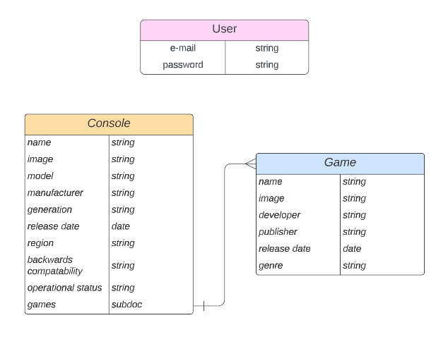

# veetoo-go-ss

### The Server Side of the V2 GO games organizer that lets users organize their consoles and games.

## Technologies used

- Javascript
- HTML
- CSS
- MongoDB
- Node.js
- bcrypt 5.1.0
- cors 2.8.5
- express 4.18.2
- jsonwebtoken 9.0.0
- mongoose 6.9.0
- nodemon": 2.0.20
- passport": 0.6.0
- passport-jwt 4.0.1
- MongoDB Compass
- Postman

## ERD

## Routes Table

|NAME|PATH|HTTP VERB|PURPOSE|
|---|---|---|---|
|Sign Up|/sign-up|POST|Sign up for an account|
|Sign In|/sign-in|POST|Sign in to an account|
|Create Game|/games|POST|Create a game|
|Update Game|/games/:id|PATCH|Update a game|
|Delete Game|/games/:id|DELETE|Delete a game|
|Create Console|/consoles|POST|Create a console|
|Update Console|/consoles/:id|PATCH|Update a console|
|Delete Console|/consoles/:id|DELETE|Delete a console|
|Index Console|/consoles|GET|Index all consoles|
|Show Console|/consoles/:id|GET|Show a console|
|Seed Console|/consoles/seed|GET|Seed consoles|